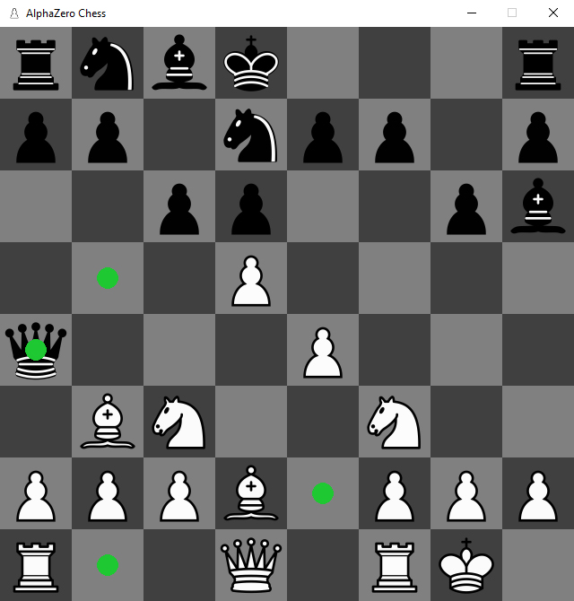

# AlphaZero Chess

Python implementation of the AlphaZero algorithm for playing Chess. More information can be found in the [report](report.pdf).

## Dependencies

```bash
pip install -r requirements.txt
```

## Usage

Playing against the model:

```bash
python play.py
```



## Architecture

### Input

| Feature           | Planes |
| ----------------- | -----: |
| P1 piece          | 6      |
| P2 piece          | 6      |
| Repetitions       | 2      |
|                   |        |
| ~~Colour~~        | ~~1~~  |
| ~~Total move count~~ | ~~1~~  |
| P1 castling       | 2      |
| P2 castling       | 2      |
| En passant        | 1      |
| No-progress count | 1      |
